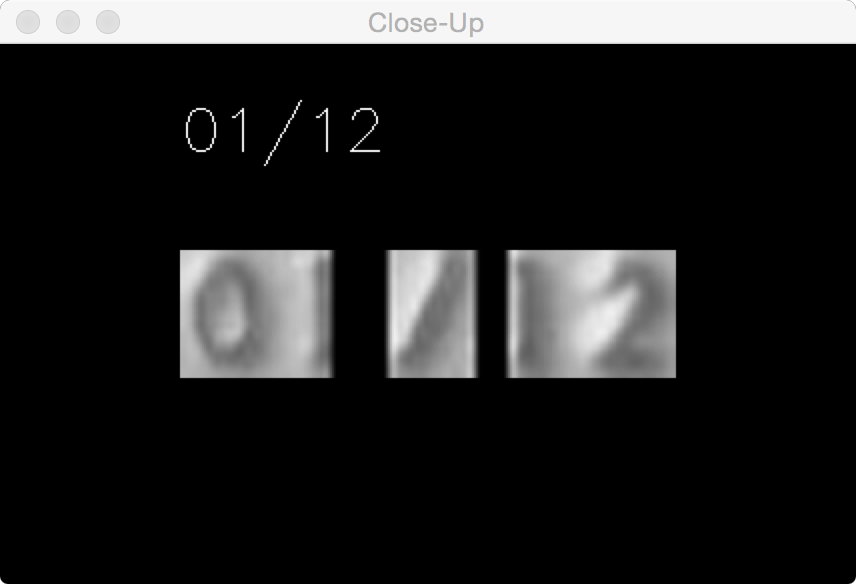
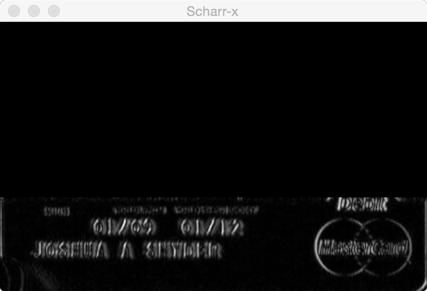
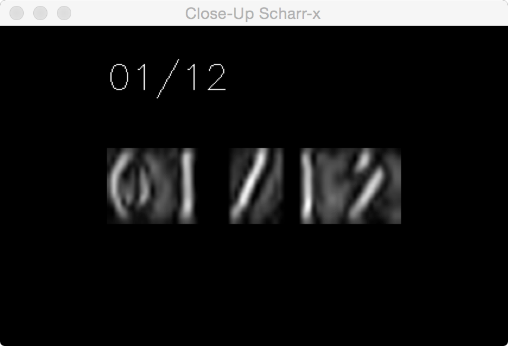
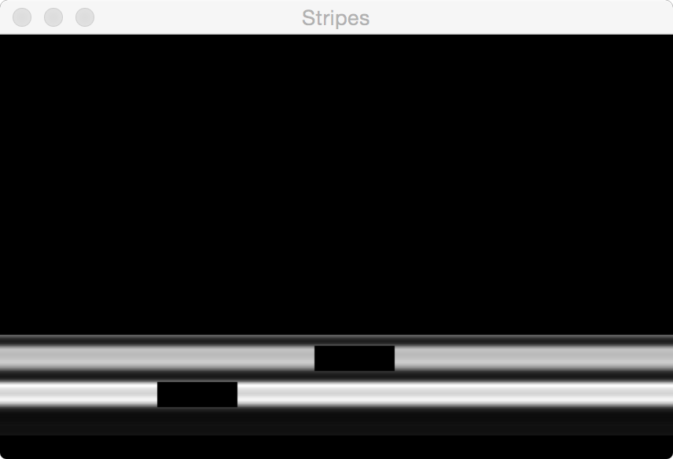
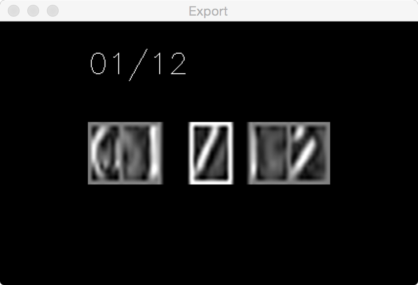

Expiry Segmentation
-------------------

## Overview

In the field of computer vision, "segmentation" refers to isolating relevant elements from an overall image, while "categorization" refers to examining a particular element and determining what it represents.

Here, we use "segmentation" to refer to locating good candidates for the expiry information in a credit card image. Specifically, we're going to identify groups of individual characters that we think might represent an expiration date. Then each of those individual characters will be "categorized" as a particular digit or a slash character, and the overall group evaluated as a possible expiration date.

False positives - identifying non-expiry pixels as a possible expiration date - are not only acceptable during segmentation, but expected. For example, some cards include a start date as well as an expiry date; our segmentation code will identify both of these. For another example, the characters comprising the customer's name are the same size and font as the expiry characters, and so will be identified by our segmentation code.

False negatives - failing to identify the actual expiration date - are undesirable, but inevitable. That's why card.io looks at a live stream of images (30 frames per second) rather than just a single snapshot.

## Outline of the card-scanning process

#### 1. Identify the four card edges.

This is a surprisingly complicated task, described elsewhere [TBD].

#### 2. Geometrically transform the image to produce a properly sized rectangle.

Described elsewhere [TBD].

#### 3. Locate the card number.

This is an even more complicated task! [TBD]

If unsuccessful, then proceed to next image from the video stream. Otherwise, continue.

#### 4. If we have not yet achieved confidence in the card number's value, then categorize the digits from the current image.

#### 5. In the part of the card below the card number, look for expiry candidates as follows.

Code for the following steps starts with `best_expiry_seg()` in `expiry_seg.cpp`.

#### 6. Submit the expiry candidates for categorization.

Look for expiry candidates
--------------------------

#### A. Assign each pixel a "verticalness" `score`

Each pixel's score is based on the degree to which it appears to be part of a near-vertical line segment.

The strokes of the characters comprising an expiration date will score very highly in this step.

This score is calculated via the [Sobel operator](http://en.wikipedia.org/wiki/Sobel_operator) along the x-axis. (Actually, we are using a special case of Sobel known as the [Scharr operator](http://en.wikipedia.org/wiki/Sobel_operator#Alternative_operators).)

*Original image:*

*Sobel image:*

  
#### B. Calculate the total score for each `row`.

A "row" is a rectangle one pixel in height, with width equal to the width of the card image.

#### C. Calculate the total score for each `stripe`.

A "stripe" is a group of N contiguous rows, where N is the height of a standard expiry character.

There is a stripe for each y-coordinate of the card image below the card number (until you nearly bump into the bottom of the card).

#### D. Determine the 3 non-overlapping stripes with the highest total scores.

I.e., find the stripe with the highest total score. 

Usually the 2 highest-scoring stripes will represent the expiry and the customer's name. But some cards have additional distractions.

*Stripes; the brightness of each row indicates it total score. The position of the black rectangle within each stripe indicates the stripe's rank (i.e., stripe #1's black rectangle appears to the left of stripe #2's).*

  
#### E. Within each of these 3 stripes, look for candidate groups of characters as follows.

All candidate groups will eventually be sent to the expiry categorization pipeline.

Look for candidate groups
-------------------------

#### i. Calculate the total score for each possible character-rect within the stripe.

A "character-rect" is a rectangle with the height and width of a standard expiry character.

There is a possible character-rect for each x-coordinate of the stripe (until you nearly bump into the right margin).
  
#### ii. Determine the highest-scoring, non-overlapping character-rects.

#### iii. Examine this list of character-rects, and identify groups.

A "group" is a set of character-rects where the x-axis distance between each character-rect and the next is less than the width of a standard expiry character.

Each group includes as many character-rects as possible. I.e., if there are seven character-rects that meet the distance requirement, while their neighboring character-rects to the left and right are excessively distant, then all seven will be identified as belonging to a single group. 

#### iv. For each group, tidy up the character-rects as follows.

Ignore groups of less than 5 character-rects, since the shortest valid expiry is MM/YY.

Tidy up each group
------------------

#### a. "Regrid" the group.

Now that we have identified a candidate group of character-rects, we reexamine the group to better identify the individual character-rects it contains.

We determine the best regular spacing of character-rects, and also the best left-margin within the group, that:

* minimizes the sum of pixel-scores between character-rects, and
* maximizes the sum of pixel-scores within the grid squares.

I.e., we determine the spacing/left-margin which minimize the ratio of the former to the latter.

#### b. "Optimize" the group.

Shift each character-rect a couple of pixels in all four directions, to determine the position that yields the highest total score for the character-rect.

#### c. Look for a slash character, in a reasonable position.

Using a neural-net, deep-learning model, we evaluate each character-rect to see if it represents a slash character (`/`).

For the moment, the only expiration date pattern that we accept is MM/YY.

Therefore, the only groups accepted at this stage are those consisting of five character-rects, the middle character-rect being a slash character. (If a group contains more than 5 character-rects, then we accept any 5-character-rect subgroup with a central slash.)

*Final results:*

